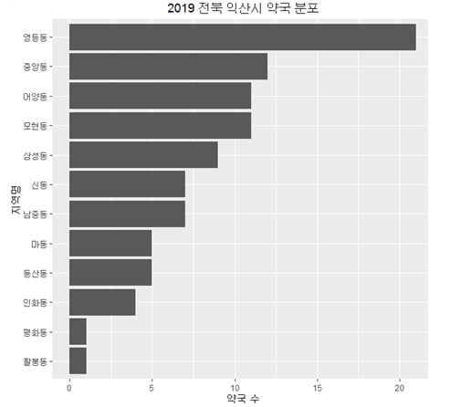
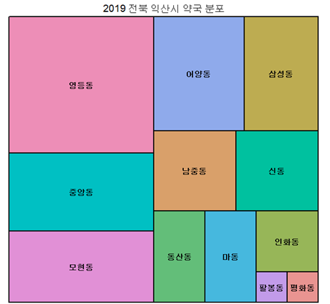

# Iksan_Pharmacy_Bigdata_Analysis
> 학부생 3학년 2학기 때 진행한 공공데이터와 R언어를 사용한 익산시 약국현황 분석

## Installation

-

## Usage example

R언어와 공공데이터를 이용한 사업 현황 분석

## Development setup

R studio

## Release History

* 1.0.0
    * first
    * 실습 완료

## Meta

김준혁 – wnsgur1198@naver.com

## Contributing

1. Fork it (<https://github.com/yourname/yourproject/fork>)
2. Create your feature branch (`git checkout -b feature/fooBar`)
3. Commit your changes (`git commit -am 'Add some fooBar'`)
4. Push to the branch (`git push origin feature/fooBar`)
5. Create a new Pull Request

<!-- Markdown link & img dfn's -->
